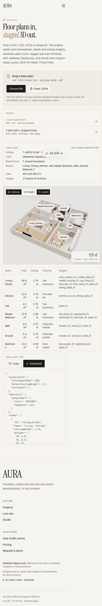
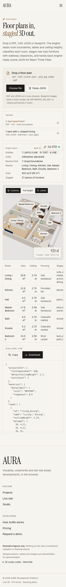
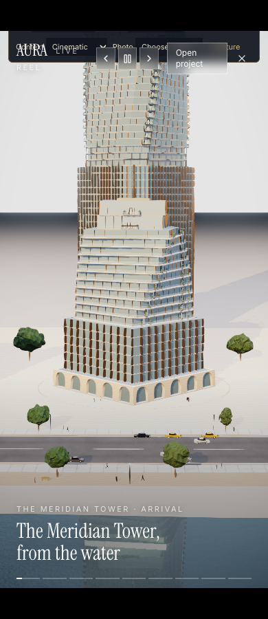
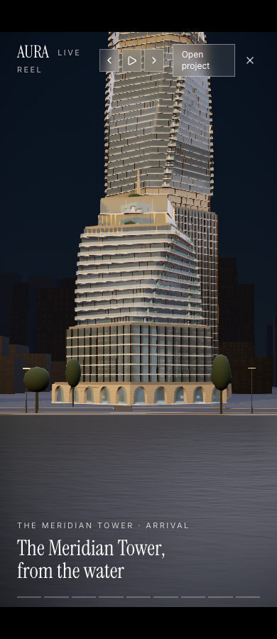

# AURA QA report

Audit started 2026-10-01 (America/Los_Angeles). Status: **NOT launch approved**.

This is the findings ledger, recorded before product fixes. Existing uncommitted work is preserved. Passing a subset of tests does not establish a zero-finding full pass.

## Initial findings, severity-ranked

| ID | Severity | Finding and evidence | Required outcome |
|---|---|---|---|
| QA-001 | P0 | Requested sign-up, create project, share-token, reservation, organization isolation and XLSX flows do not exist in the route/component inventory. Data is static project content; scenarios use localStorage. | Remains blocked under the no-new-features constraint; cannot certify these flows or tenant isolation. |
| QA-002 | P1 | Both API POST handlers dereference parsed JSON without validating an object. `null` causes an exception. Body limits are checked only after full allocation. | Bounded streamed parsing, shape validation and regression tests. |
| QA-003 | P1 | ScenarioDrawer suppresses storage write failures, then displays the scenario as saved. Reload loses it. Parsed storage is blindly cast to Scenario[]. | Retain draft on failure; report actionable error; validate stored data before use. |
| QA-004 | P1 | No configured CSP, HSTS or defensive response headers in next.config.mjs. Inference endpoints have no authentication/rate controls. | Verify deployed headers and protect inference access; no invented tenant-security claim. |
| QA-005 | P1 | Demo/enquiry forms claim “we’ll be in touch” or “request received” despite sending nothing. | Honest status that does not imply delivery; actual delivery remains unimplemented. |
| QA-006 | P2 | fmtMoney(-0.1) returns `−$0`; full format discards cents. | Consistent nonfinite/negative-zero handling and cent-preserving full precision. |
| QA-007 | P1 | Scenario load lacks input schema/range checks; malformed finite/NaN/shape values can reach finance engine. | Reject invalid scenarios and protect calculations. |
| QA-008 | P1 | Requested physical devices, GPU throttling, Safari/Edge/Firefox and performance budgets lack a reproducible test setup. Browser caches do not match installed Playwright. | Record actual tested engines and unavailable targets; emulation is not physical-device proof. |
| QA-009 | P2 | Chart CSS removes all focus outlines, including keyboard focus. | Preserve keyboard-visible focus. |

## Baseline evidence

- `npm run lint`: passed TypeScript check before edits.
- `npm audit --json`: passed, zero known advisories (278 dependencies reported). First sandboxed attempt failed DNS; network-enabled retry succeeded.
- User has extensive existing changes; no reset or cleanup performed.
- Design authority: existing paper/stone/ink tokens, Inter and Instrument Serif. Refinements preserve those choices.
- Browser/visual, accessibility, finance and production measurements: pending. No scores fabricated.

## Coverage policy

Every requested check remains open until demonstrated. Real Safari is not equivalent to Playwright WebKit; mobile emulation is not an iOS/Android device. GPU performance on this host cannot certify a mid-range laptop or 2017 phone. Missing features will not be invented to satisfy a test.

### Browser findings recorded before their fixes

- **QA-010 P1:** Axe detects `aria-prohibited-attr` on RangeSlider wrappers on Studio and project pages. The Radix root is a generic span; the named thumb already supplies slider semantics.
- **QA-011 P1:** Engine upload input has no accessible name (`label` violation).
- **QA-012 P2:** Studio panels skip from h1 to h3 (`heading-order`). Tour lacks main landmark and h1. Baseline: `docs/qa/before/results.json`.
- **QA-013 P1:** Baseline browser console reports repeated resource 404s. Must identify failed URLs and validate on a fresh production build.
- **QA-014 P1:** SegmentedControl radio buttons default to submit inside enquiry forms and lack arrow-key radio navigation. Changing enquiry intent can submit the form. Add explicit button type and roving keyboard focus.

**Baseline environment correction:** inspected the first Studio screenshot and found the pre-existing server on port 3123 serves stale HTML with missing CSS/JS (404). Its captures prove a broken local build, not the current styled interface. That run was stopped; do not use its axe results as styled contrast evidence. A fresh isolated build will provide the valid baseline. Semantic defects identified in source remain valid.

- **QA-015 P0:** Fresh production compilation failed at BuildingScene.tsx:397: numeric `PCFSoftShadowMap` is not assignable to Fiber Canvas `shadows`. This appeared during concurrent rendering edits. Preserve the intended soft-shadow mode using the supported `"soft"` value, then rebuild.

### Fix decisions

- Money: retain compact dashboard presentation, show cents when full precision is requested, and normalize values rounding to zero.
- Forms remain explicit previews; no new submission integration was added.
- Script CSP uses unpredictable per-request nonces (no production `unsafe-inline` or `unsafe-eval` in script-src). Styles retain inline permission required by Three/Radix/Motion. Server pages become request-rendered; static exports need equivalent host security configuration and are not certified by these headers.

### Regression results (first code pass)

`docs/qa/regressions.txt`: 8/8 tests pass. Includes malformed/chunked oversized API input, scenario write failures and read validation, money formatting, independent one-floor arithmetic ($1,000,000 revenue; $361,000 cost; $639,000 profit), all projects at default/min/max slider settings, and negative-profit/zero-revenue cases. This proves those cases, not every requested finance edge. In particular zero sales absorption is outside the current slider range and is not certified.

Mechanical design detector returned no findings for changed interface files (`docs/qa/design-detector.json`). This is not a visual or accessibility pass.

### Production pass 1 findings (before second fixes)

- **QA-016 P1:** CSP blocks the 3D decoder's WebAssembly and GLTF blob textures. Add only `wasm-unsafe-eval` (not JS unsafe-eval) and blob connection support. Pass1 browser logs demonstrate the failure.
- **QA-017 P1:** Positive and oak text fail 4.5:1 on paper/stone surfaces (4.28 and 3.59 respectively); muted `text-ink/60` reaches only 4.37. Darken existing light-theme hues and use the ash text token.
- **QA-018 P1:** Engine overflows to 578px at 390px; its JSON output is not keyboard-scrollable. Constrain grid children and make the output region focusable.
- **QA-019 P1:** 3D emits deprecated THREE.Clock and removed PCFSoftShadowMap warnings. Use supported percentage shadows; Clock originates in renderer dependency and needs compatible dependency evaluation, not suppressed logging.
- **QA-020 P1:** 3D also reports `Cannot read properties of null (reading elements)`. Investigate separately after decoder recovery; no fix claim yet.
- **QA-021 P1:** GSAP camera tween ignores reduced-motion (useCameraTween); global CSS/MotionConfig cannot affect it. Respect the user's preference for camera transitions.

- **QA-022 P1:** CAD import reads arbitrary file sizes into memory and GLTF loader can follow external resource references. Reject oversized/empty files before allocation, limit declared binary STL triangles, and restrict imported GLTF resources to embedded data/blob URLs. Browser CSP is an additional defense, not the parser's only boundary.
- **QA-023 P1:** Tour auto-plays even when reduced motion is requested. Start paused for that preference; users can explicitly play.

### Second-pass targeted verification

`docs/qa/smoke.txt`: Studio at 390px has zero axe violations, no overflow, and no JS exception/decoder/texture errors after CSP repair. Engine width is corrected to 390px and contrast passes; the room table now exposes a separate keyboard-scrollability defect (QA-018 follow-up), addressed by a named focusable region. Both still emit the renderer dependency's THREE.Clock deprecation. No console-clean claim is made.

- **QA-024 P1:** Contact-sheet inspection shows the newly added scene presentation dock overlaps Tour navigation at 390/768px and appears in bare render exports despite the documented no-overlay variant. Pass the viewport variant into scene control visibility; retain presentation controls in the full workspace only. The added cinematic camera hook also duplicates the reduced-motion defect; apply the same preference handling there.

- **QA-025 P2:** `@radix-ui/react-switch` has no imports anywhere in application source and is unused. Remove it. `react-dom` is required by Next/React rendering even without a direct application import and is retained.

- **QA-026 P1:** Lighthouse production performance: Home 49, Projects 88, Developers 88, Studio 49, Engine 64. All five accessibility/best-practices/SEO scores are 100. These fail the requested performance thresholds. Home has 29,120ms simulated total blocking time; Studio 9,740ms. Full reports retained in `docs/qa/lighthouse-*.json`.
- **QA-027 P1:** Developers CLS 0.127; fonts are CSS-imported with swap and no metric-adjusted fallback/preload. Keep the exact existing font families, migrate to next/font/local preloading with fallback metrics, and remeasure. This is a candidate cause until retested.

- **QA-028 P2:** ProjectCard gives the lead image competing opacity-0 and opacity-100 classes plus a hydration-dependent scale. The emitted CSS resolves opacity to 100, so a blank-image claim is not established. Removed the redundant state and conflicting classes while keeping hover switching; no LCP improvement is claimed without measurement.

Font verification: Developers improves from 88 to 96 performance and CLS 0.127 to 0.000. Home, Projects and Studio also measure CLS 0.000. Engine still shifts (0.026). Performance thresholds remain unmet on other measured pages. Latest complete score table: `docs/qa/lighthouse-summary.json`.

### 3D measurement (not acceptance)

`docs/qa/graphics.json`: local headless Chrome measured 6–22fps in the initial idle samples, 31–39fps while orbiting, and 37fps at medium quality after 4× **CPU** throttling. First telemetry arrived at 3.923s but includes a one-second measurement window; it is not an exact first-frame timestamp. A build was running concurrently, so this is diagnostic evidence, not a controlled hardware benchmark. It does not establish 60fps idle, a <2s load, GPU-throttled performance, or performance on a 2017 phone. Those acceptance checks remain open.

### Browser availability and new cross-browser findings

- **QA-029 P1:** Firefox renders the tested pages but emits WebGL mipmap initialization, depth-filter portability, and texture-upload deprecation warnings. These are retained in the browser log, not suppressed. Console-clean acceptance is still failing.
- **Safari blocked:** A real `/usr/bin/safaridriver` session was attempted. Safari rejected it because **Allow remote automation** is disabled in Safari Settings. Exact response: `docs/qa/safari-availability.json`. No setting was changed. WebKit coverage is separate and does not close this check.
- Physical iOS Safari, Android Chrome and a 2017 phone are unavailable in this environment; no emulation result is labelled as a device pass.
- Final compiled snapshot identified by build ID and SHA-256 checksums in `docs/qa/tested-build.json`. Source files continued changing from another process during the audit, so the compiled snapshot—not an assumed clean checkout—is the evidence boundary.

- **QA-030 P1, investigation open:** Cross-browser contact sheets show darker water/material rendering in Firefox than Chrome/WebKit at the sampled load point (`docs/qa/comparison-2.jpg`). A settled-render comparison is needed to separate loading/auto-quality timing from shader portability. No pixel-parity or shader fix is claimed.

## Verification outcome — 2026-10-01

**NOT launch approved. No complete zero-finding pass.**

### Verified evidence

- Production builds and TypeScript checks pass (`build-release.txt`, `typecheck-final.txt`).
- 9 unit/integration regressions pass (`regressions-final.txt`).
- 7 browser flow/security regressions pass (`ui-regressions.json`): malformed API input, CSP injection rejection/nonce freshness, honest demo confirmation, failed-save recovery, refresh persistence, corrupt storage, and keyboard enquiry selection.
- Initial valid visual pass: 28 routes × 4 widths = **112 Chrome captures** (`pass1/results.json`).
- Final template regression: 8 route templates × 4 widths × Chrome/Firefox/WebKit = **96 captures**, HTTP 200, **zero axe violations**, **zero horizontal page overflow**, and no page exceptions. This final template sample does not replace a final pass over every project slug or every interactive state.
- Console warnings remain: THREE.Clock in 3D views; additional WebGL warnings in Firefox. The browser audit is therefore **not** a clean pass.
- 64 top-viewport pixel comparisons recorded in `pixel-comparison.json`; contact sheets inspected. Pixel differences are diagnostic, not automatically accepted. Firefox 3D appearance remains under investigation.
- Final npm audit: **zero known advisories** (`npm-audit-final.json`). This does not prove absence of unknown vulnerabilities or authorize public inference access.
- Native Safari session attempt blocked by disabled remote automation; Edge launch attempted and blocked because Edge is not installed. Physical mobile browsers unavailable.

### Latest measured Lighthouse scores

| Route | Performance | Accessibility | Best practices | SEO | CLS |
|---|---:|---:|---:|---:|---:|
| Home | 40 | 100 | 100 | 100 | 0.000 |
| Projects | 88 | 100 | 100 | 100 | 0.000 |
| Developers | 96 | 100 | 100 | 100 | 0.000 |
| Studio | 57 | 100 | 100 | 100 | 0.000 |
| Engine | 62 | 100 | 100 | 100 | 0.026 |

Lighthouse was run before the last redundant image-class cleanup; no post-cleanup score improvement is claimed. Local simulated-mobile scores are not production-host or physical-device certification.

### Fixed or mitigated, with evidence

| Findings | Outcome | Evidence |
|---|---|---|
| QA-002 | Bounded JSON reads and controlled invalid-object errors | Unit + HTTP regressions |
| QA-003, QA-007 | Failed saves retain drafts and report recovery; corrupt stored input rejected | Unit + browser regressions, scenario-save-error.png |
| QA-004 | Nonce CSP, HSTS and defensive server headers added; auth/abuse controls remain open | Browser CSP regression; headers tested |
| QA-005 | Preview forms do not claim successful delivery | Browser regression |
| QA-006 | Cent-preserving full money format; no negative zero/nonfinite output | Unit regression |
| QA-009–QA-012, QA-014 | Chart focus, slider semantics, headings, upload name, landmarks and enquiry keyboard behavior corrected | Final axe matrix + keyboard regression |
| QA-013 | Stale local server isolated; fresh production snapshots serve assets successfully | Final browser HTTP/error logs |
| QA-015 | Renderer shadow prop uses supported typed mode | Production build/typecheck |
| QA-016, QA-020 | Decoder and texture CSP failures and associated page exception disappear | Final production page-error logs |
| QA-017, QA-018 | Contrast corrected, Engine mobile overflow removed, scroll regions keyboard-focusable | Final axe/overflow logs and screenshots |
| QA-019 | Removed shadow-mode warning; upstream Clock warning remains | Console logs |
| QA-021, QA-023 | Camera tween respects reduced-motion at transition start; Tour starts paused | Source + paused Tour capture; all-motion coverage remains open |
| QA-022 | Empty/oversized/corrupt STL rejected; GLTF external resources restricted | CAD regressions; exhaustive execution-attack coverage remains open |
| QA-024 | Scene dock removed from bare Tour/render views | Final Tour and render screenshots |
| QA-025 | Unused switch dependency removed | package/lockfile check + build |
| QA-027 | Developers CLS corrected from 0.127 to 0.000 | Lighthouse before/after scores |
| QA-028 | Redundant image state and conflicting classes removed | Build + rendered project screenshots; no measured speed claim |

### Before / after visual evidence

Engine at 390px — before, 578px overflow:

Engine after — 390px document width and keyboard-scrollable table/JSON regions:

Tour before — overlapping scene dock:

Tour after — unobstructed navigation and paused reduced-motion state:

### Remaining launch gates, severity-ranked

1. **P0:** Requested signup/create/share/reserve/XLSX/organization flows do not exist. Adding them would violate the explicit no-new-features scope. Cross-tenant and share-token security cannot be certified against an absent subsystem.
2. **P1:** Home/Projects/Studio/Engine performance misses the stated thresholds; Engine CLS remains nonzero. Controlled <2s/60fps/30fps GPU/device acceptance remains unproven.
3. **P1:** Renderer/driver console warnings and Firefox 3D visual parity remain unresolved. Full motion/geometry/clip/seam guarantees are unproven.
4. **P1:** Public inference authentication/abuse limits, exhaustive malicious-upload cases, and deployed HTTPS/static-host configuration are not certified.
5. **P1:** Safari automation disabled, Edge absent, real iOS/Android and 2017 phone unavailable. No browser was silently marked passed.
6. **P1:** Full final every-slug/every-state sweep, every-label copy review, rounded-cent display/export reconciliation, full keyboard flows, 200ms feedback timing, network-interruption coverage, 10,000-unit CSV and 50-tab stress acceptance remain unfinished or unsupported. No bundle budget was supplied; no budget pass is invented.
7. **P1:** Concurrent source changes require a fresh full audit of the eventual release commit. Evidence here is limited to the recorded compiled snapshots.

The loop cannot truthfully reach zero within the current no-new-features scope and available device/browser configuration. The launch checklist is deliberately incomplete. Reproduction instructions: `scripts/qa/README.md`.
