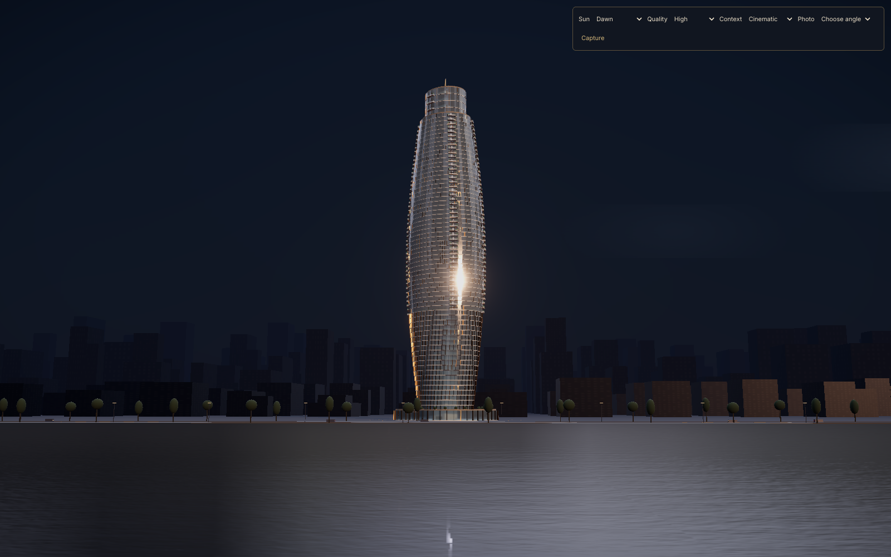
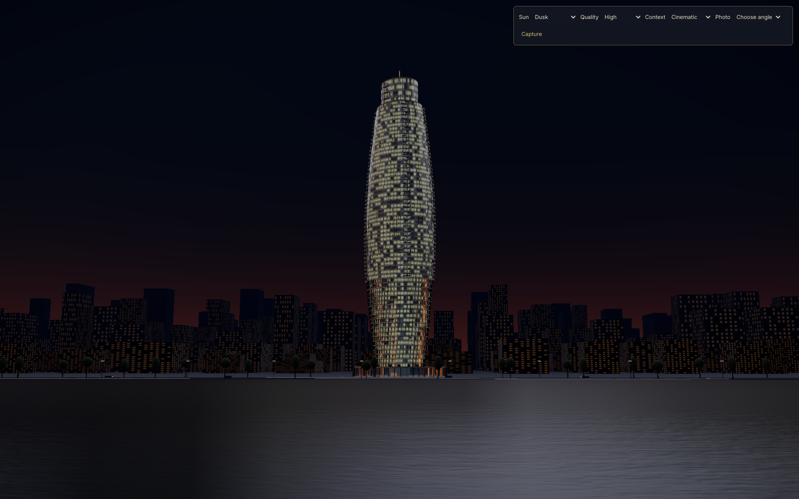
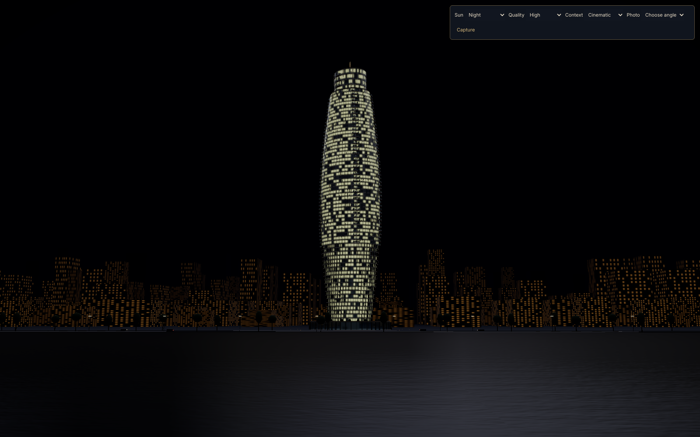
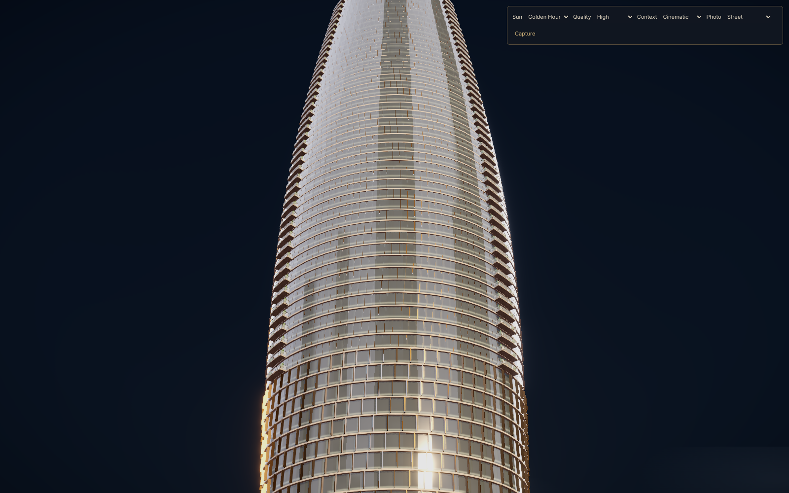
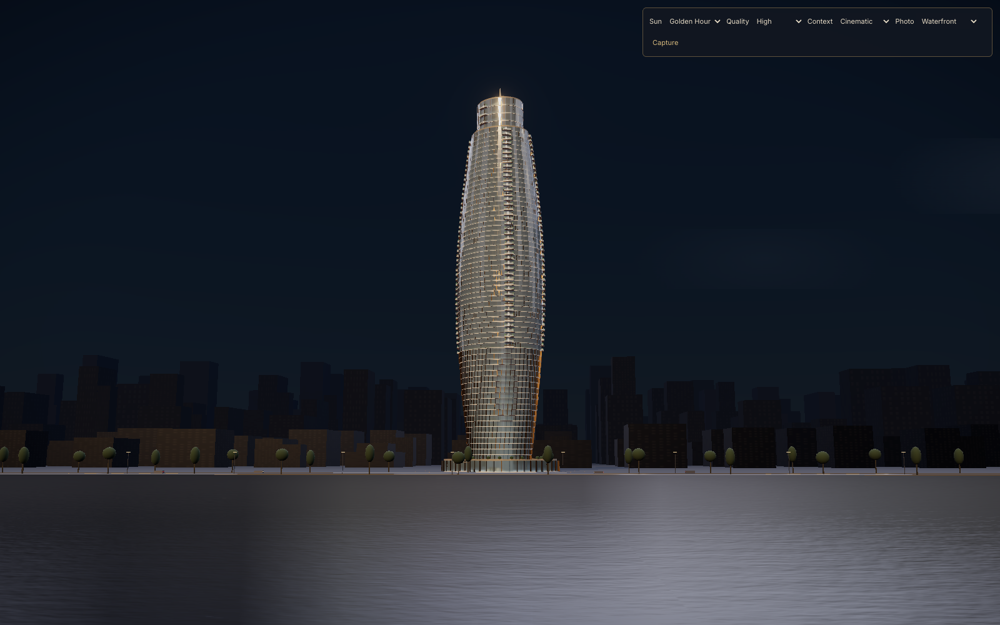
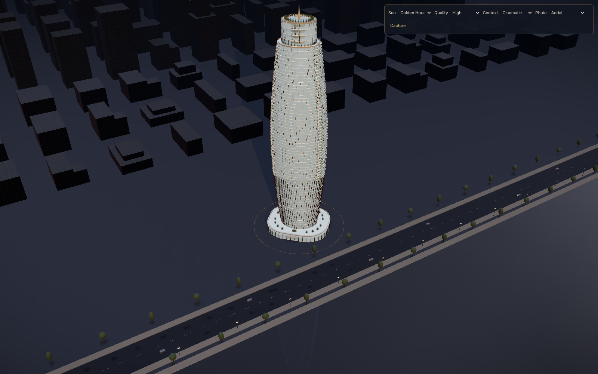
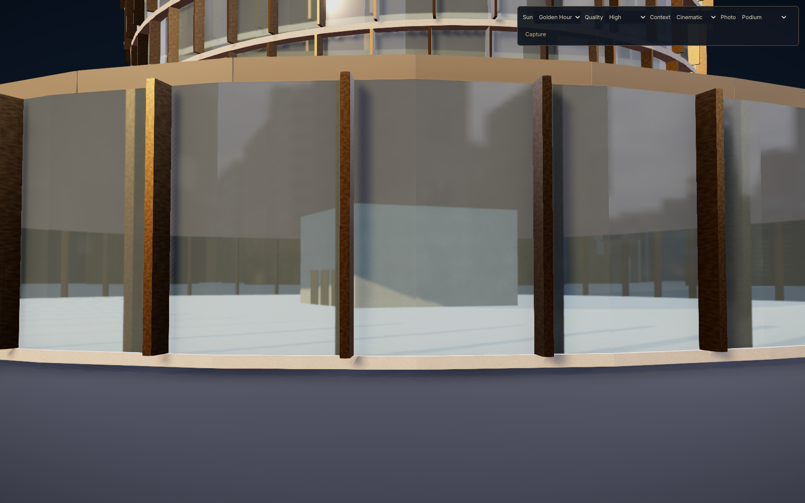
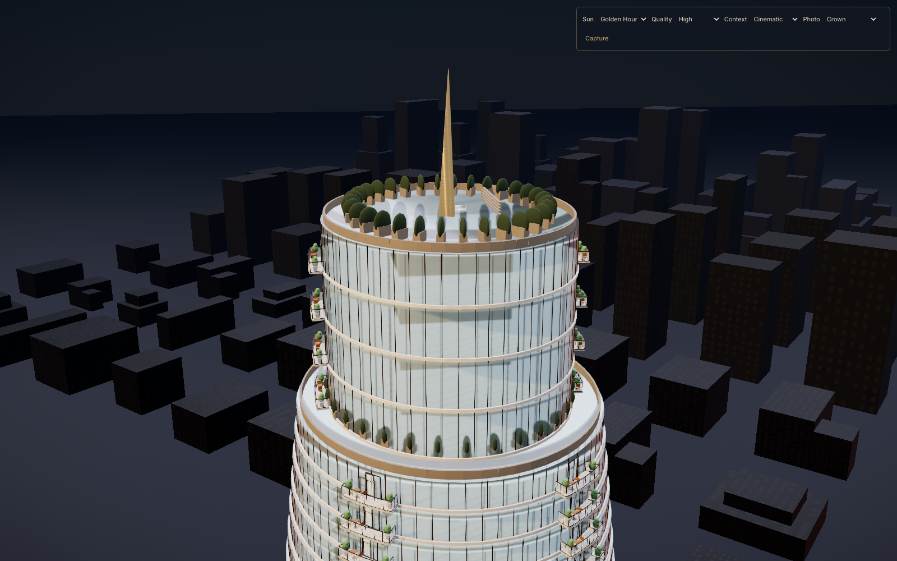

# Cinematic scene captures

Production Chrome captures at 1600 × 1000. The mobile view is 390 × 844. See [graphics notes](../GRAPHICS.md) for implementation details, measured performance and known limitations.

## Sun presets

| Dawn | Golden Hour |
| --- | --- |
|  |  |
| Dusk | Night |
|  |  |

## Photo angles

| Street | Waterfront |
| --- | --- |
|  |  |
| Aerial | Podium |
|  |  |
| Crown | |
|  | |

## Interaction verification

[Full explorer](explorer-dock.png) · [Map access](explorer-map.png) · [Night floor focus](explorer-night-focus.png) · [Focused controls](explorer-focus-controls.png) · [Explosion](explorer-exploded.png) · [Mobile explorer](explorer-mobile.png)

[Renderer measurements](results.json) · [Ten-minute orbit](soak.json) · [Interaction checks](interaction-results.json)
